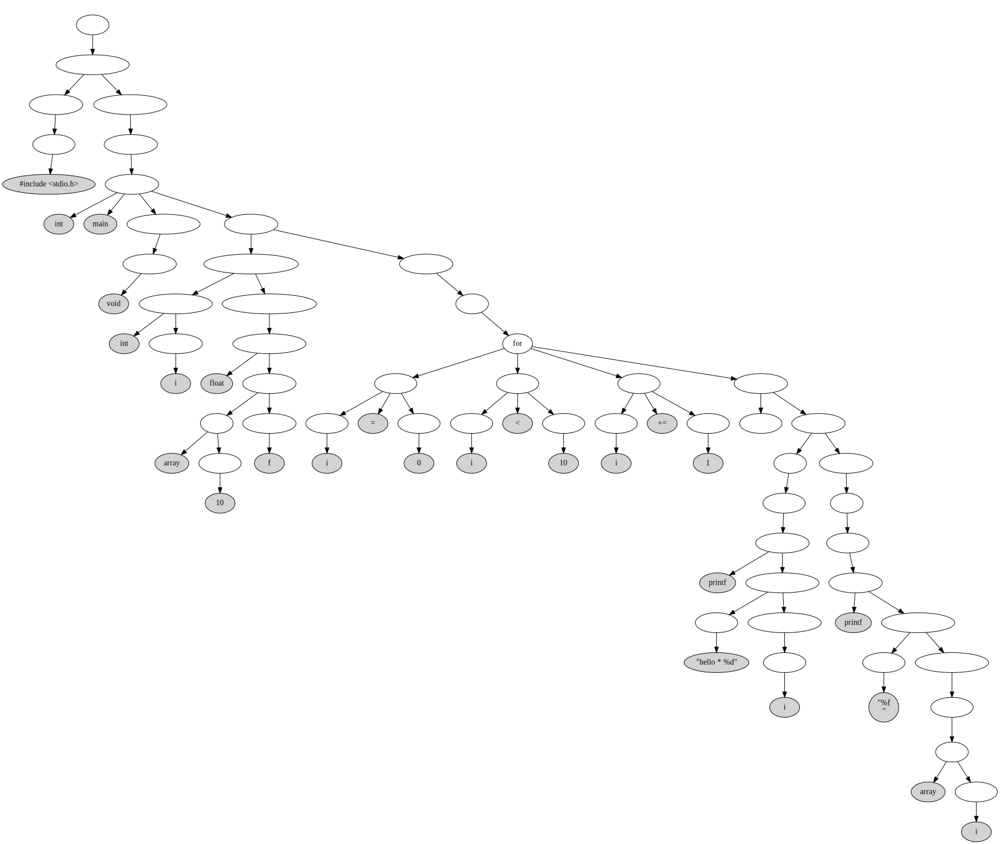

# informater

C 语言格式化器 - 华科计科数据结构课设

## 依赖

- `graphviz` 用于画图。

```console
$ sudo apt install graphviz # for Debian or Ubuntu
$ sudo dnf install graphviz # for Fedora or CentOS
$ sudo pacman -S graphviz # for ArchLinux or Manjaro
```

- 一个可以查看矢量图的图片浏览器（或者一个现代浏览器）。

## 构建

```console
$ cd informater
$ mkdir build
$ make all # 如果使用 clang 可以加上 CC=clang
```

会在`./build`目录生成可执行文件`informater`。


## 测试和使用

```console
% ./build/informater
Usage: informater [options] file...
Options:
  -h                display this information
  -l                display lex information
  -o after-file     redirect output to after-file
  -t ast-graph      generate a dot image with AST
```

使用如下命令可以将`before.c`文件格式化为`after.c`文件，并将 AST 保存在`build/AST-graph.dot`中。如果不使用`-o`选项，格式化后的结果会直接输出。

```console
$ ./build/informater -t build/AST-graph.dot -o after.c before.c
$ dot -Tsvg build/AST-graph.dot -o build/AST-graph.svg # 由 .dot 文件生成矢量图
```

也可以直接运行`test/draw.sh`，然后查看`./build/AST-graph.svg`文件，它是生成的抽象语法树。

```console
$ ./tests/draw.sh example/test-02.c
$ for p in ./build/*.svg; do xdg-open $p; done
```


## 缺陷

支持的语法不丰富。

