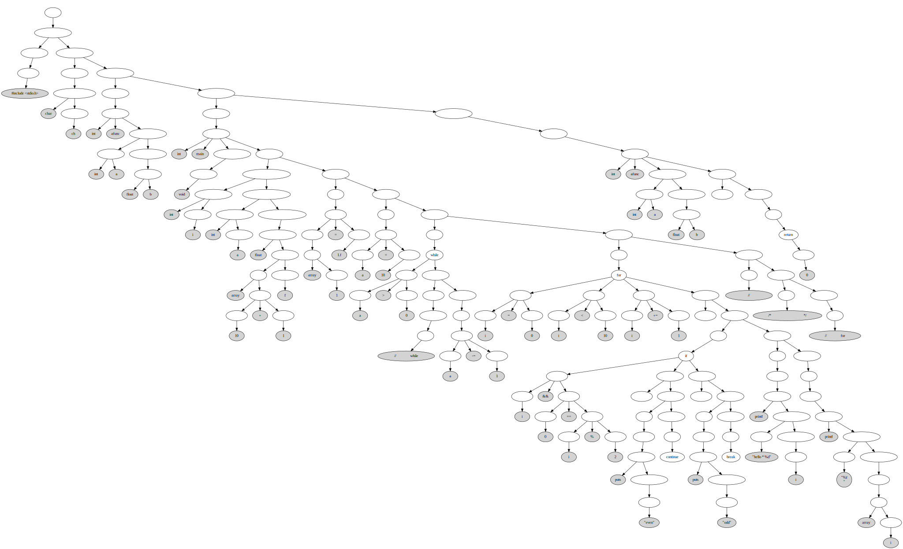

# informater

C 语言格式化器 - 华科计科数据结构课设

## 依赖

- `graphviz` 用于画图。

```console
$ sudo apt install graphviz # for Debian or Ubuntu
$ sudo dnf install graphviz # for Fedora or CentOS
$ sudo pacman -S graphviz # for ArchLinux or Manjaro
```

- 一个可以查看矢量图的图片浏览器（或者一个现代浏览器）。

## 构建

```console
$ cd informater
$ mkdir build
$ make all
```

会在`./build`目录生成两个可执行文件`ast2graph`和`informater`。


## 测试和使用

可以查看`./build/RE-tree.svg`文件，它包含了正则表达式编译的中间结果。

```console
$ ./tests/draw.sh example/test-01.c
$ for p in ./build/*.svg; do xdg-open $p; done
```


## 缺陷

还没有添加格式化功能。

还有点漏内存，不过这个好解决。

支持的语法不丰富。

## 文档编写中...

